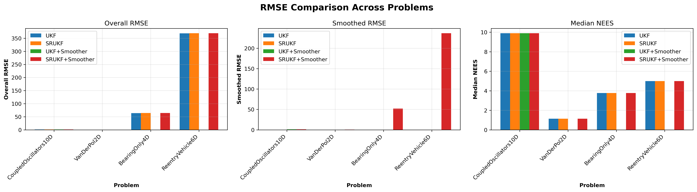
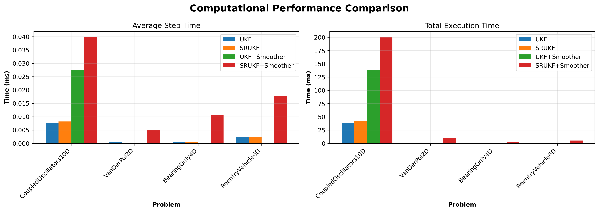
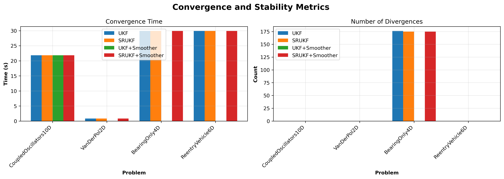
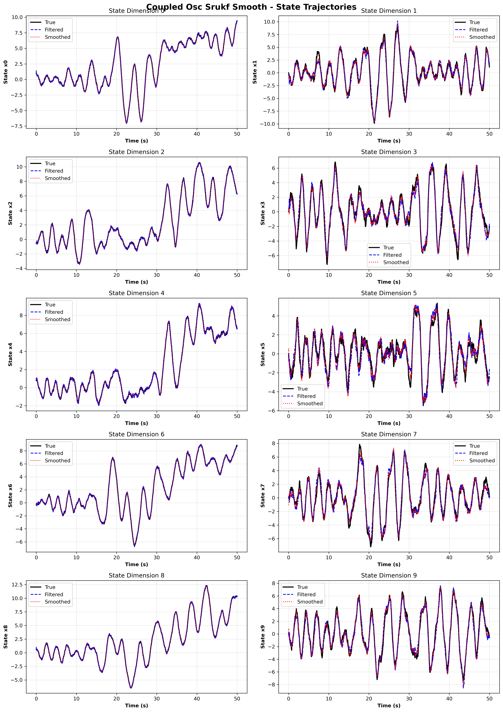
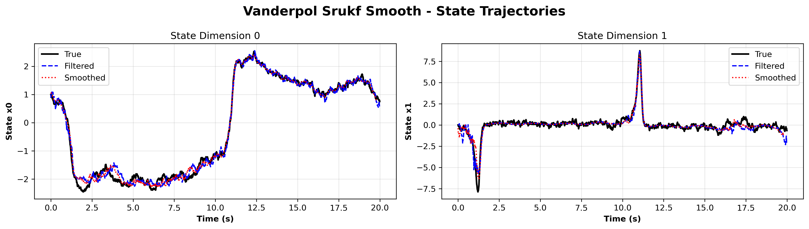
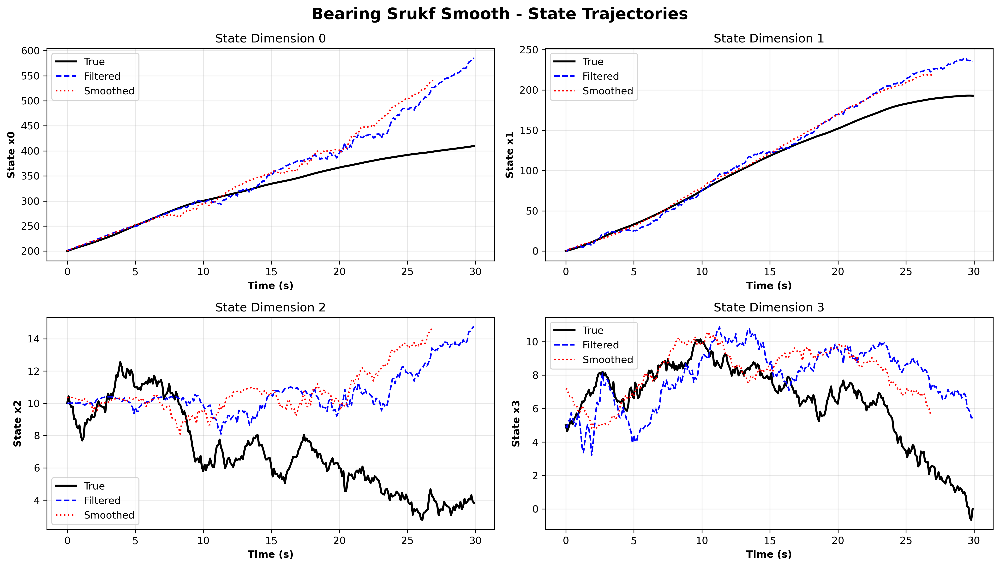
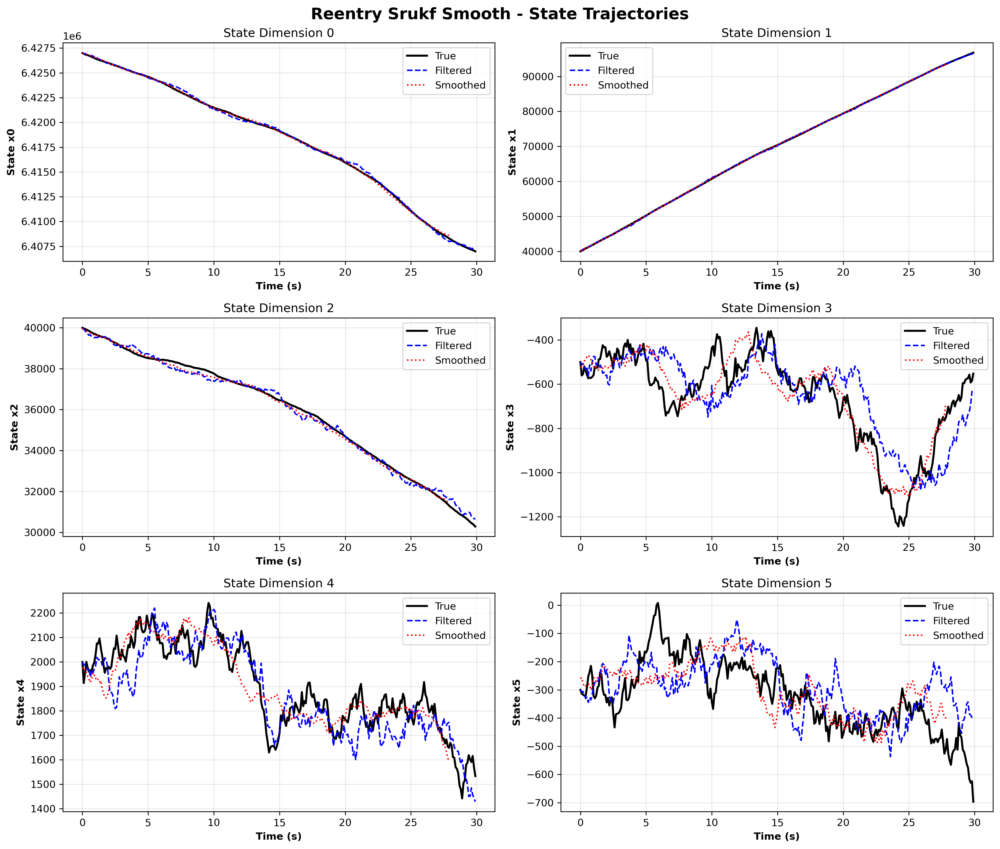

# Modern Computational Nonlinear Filtering

<div align="center">

**High-Performance Nonlinear State Estimation for Embedded Systems**

[](https://isocpp.org/)
[](https://www.raspberrypi.com/)
[](LICENSE)
[](https://developer.arm.com/Architectures/Neon)

</div>

---

## Table of Contents

- [Overview](#overview)
- [Implemented Filters](#implemented-filters)
- [Benchmark Results](#benchmark-results)
- [Numerical Stability Guide](#numerical-stability-guide)
- [Features](#features)
- [Dependencies](#dependencies)
- [Build Instructions](#build-instructions)
- [Usage Examples](#usage-examples)
- [Architecture](#architecture)
- [Contributing](#contributing)
- [References](#references)

---

## Overview

This repository provides nonlinear filtering implementations optimized for **ARM aarch64** (Raspberry Pi 5, Orange Pi 5/6) and **x86_64** using **ARM NEON/SVE2 intrinsics**, **Vulkan compute shaders**, and **NVIDIA CUDA**. All implementations use single-precision floating point (`float`) for maximum SIMD vectorization efficiency.

### What's Included

- **5 Filtering Methods**: EKF, UKF, SRUKF, PKF, RBPKF
- **Fixed-Lag Smoothers**: Rauch-Tung-Striebel (RTS) backward pass and ancestry-based smoothing
- **Comprehensive Benchmarks**: 4 challenging test problems with full metrics (10D coupled oscillators, Van der Pol, bearing-only tracking, reentry vehicle)
- **Hardware Acceleration**: NEON dense linear algebra + Vulkan particle operations + CUDA GPU acceleration via [OptimizedKernels](https://github.com/n4hy/OptimizedKernelsForRaspberryPi5_NvidiaCUDA) (OptMathKernels), pinned to release tag **[v0.5.17](https://github.com/n4hy/OptimizedKernelsForRaspberryPi5_NvidiaCUDA/releases/tag/v0.5.17)**

### Platform Support

| Platform | Acceleration | Status |
|----------|--------------|--------|
| ARM aarch64 (Pi 5, Orange Pi) | NEON + SVE2 + Vulkan | **Full Support** |
| x86_64 Linux | Vulkan + OpenMP + Eigen | **Full Support** |
| NVIDIA GPU (CUDA 12.x / 13.x) | cuBLAS GEMM + GPU Particle Filter | **Full Support** (SM 75–120) |

> **Note**: CUDA 12.x covers Turing through Hopper (SM 75–90). CUDA 13.x adds Blackwell — including consumer RTX 50-series (**SM 120**, e.g. RTX 5070/5080/5090). Verified on an RTX 5070 Ti (SM 120) with CUDA 13.1; also rebuilt cleanly with CUDA 13.0.88 on Linux 6.17 NVIDIA kernel (multi-arch default). To build for your exact GPU, configure with `-DCMAKE_CUDA_ARCHITECTURES=native -DOPTMATH_CUDA_NATIVE=ON`. See [DEVELOPMENT_NOTES.md](DEVELOPMENT_NOTES.md) for details.

---

## Implemented Filters

### 1. Extended Kalman Filter (EKF)

**Jacobian-based linearization**

- **Method**: First-order Taylor series approximation
- **Requirements**: Explicit Jacobian matrices
- **Smoothing**: RTS fixed-lag backward pass
- **Best For**: Mildly nonlinear systems, fast prototyping
- **Location**: `EKF/`

### 2. Unscented Kalman Filter (UKF)

**Derivative-free sigma point method**

- **Method**: Deterministic sampling via Merwe scaled unscented transform
- **Parameters**: Dimension-adaptive (alpha=1.0, beta=2.0, kappa=3-n)
- **Smoothing**: RTS with cross-covariance tracking
- **Best For**: Highly nonlinear systems where Jacobians are unavailable or expensive
- **Location**: `UKF/`
- **Optimization**: SVE2/NEON-accelerated GEMM, Cholesky, SPD solve via FilterMath dispatch

### 3. Square Root UKF (SRUKF)

**Numerically stable square root formulation**

- **Method**: Propagates Cholesky factor S where P = S*S^T
- **Algorithm**: QR decomposition + rank-1 Cholesky updates/downdates with safe fallbacks
- **Advantages**:
  - Guaranteed positive-definite covariance
  - Innovation gating prevents catastrophic updates
  - Safe Cholesky downdate with automatic fallback to full recomputation
- **Best For**: Mission-critical, long-duration, weak observability systems
- **Location**: `UKF/include/SRUKF.h`

### 4. Particle Filter (PKF)

**Bootstrap sequential importance resampling**

- **Method**: Monte Carlo approximation with particle ensemble
- **Resampling**: Systematic, stratified
- **Smoothing**: Ancestry-based fixed-lag trajectory reconstruction
- **Best For**: Non-Gaussian noise, multimodal distributions
- **Location**: `PKF/`
- **Optimization**: Vulkan GPU acceleration for N > 100 particles, OpenMP parallel propagation

### 5. Rao-Blackwellized Particle Filter (RBPKF)

**Hybrid particle-Kalman filter**

- **Method**: Marginalize linear substructure analytically via conditional Kalman filters
- **Structure**: Nonlinear particles + linear Kalman filters per particle
- **Advantages**: Reduced variance vs standard particle filter
- **Best For**: Systems with conditionally linear subspace (e.g., CTRV models)
- **Location**: `RBPKF/`

---

## Benchmark Results

Four challenging problems tested with UKF, SRUKF, and fixed-lag smoothers. Benchmarks run through the FilterMath dispatch layer (CUDA cuBLAS / SVE2 / NEON / Eigen, selected at runtime by platform).

> **Latest run**: 8 July 2026 on **Ubuntu 26.04 LTS x86_64**, **NVIDIA GeForce RTX 5070 Ti Laptop GPU (Blackwell, SM 120)** with **CUDA 13.1**, Eigen 3.4, Vulkan 1.4, against **OptMathKernels v0.5.17** (pinned release tag). All **25/25** CTest cases pass (9 filter tests + 16 OptimizedKernels GPU/SIMD tests, including the CUDA kernel suite on the Blackwell GPU and the Vulkan suites, which now auto-select the discrete RTX 5070 Ti).

> **Host note**: the **RMSE / NEES / divergence** figures are backend-independent
> and reproduce on any platform (the FilterMath dispatch selects CUDA / SVE2 /
> NEON / Eigen but computes the same result). The **25/25** count and the wall-clock
> **timings** are specific to that x86_64 + CUDA reference host: a CPU-only or ARM
> host runs the Eigen/NEON path (no CUDA suite; the count and per-step times differ)
> and still reproduces the accuracy numbers. Build and CTest are exercised on ARM
> (aarch64) as well as the x86_64 reference host.

Reproduce everything below with:

```bash
# from the build directory (see Build Instructions)
./Benchmarks/run_benchmarks                              # writes benchmark_results.csv + trajectory CSVs
source ../.nlfvenv/bin/activate                          # Python venv created by the build
python3 ../scripts/plot_benchmarks.py .                  # writes the PNGs shown here
```

### Summary Across All Problems

**Estimation accuracy** — filtered vs. smoothed RMSE and filter consistency (median NEES):



**Computational cost** — per-step and total wall-clock time (x86_64 + Eigen path):



**Convergence & stability** — time-to-converge and divergence counts:



Consolidated metrics from the latest run (`benchmark_results.csv`):

| Problem | Filter | RMSE | Smoothed RMSE | NEES median | In 95% | Avg step | Total | Div |
|---------|--------|-----:|--------------:|------------:|-------:|---------:|------:|----:|
| Coupled Osc 10D | UKF | 1.457 | — | 9.89 | 94.5% | 0.0076 ms | 38.2 ms | 0 |
| Coupled Osc 10D | SRUKF | 1.457 | — | 9.89 | 94.5% | 0.0082 ms | 41.5 ms | 0 |
| Coupled Osc 10D | UKF+Smoother | 1.457 | **1.148** | 9.89 | 94.5% | 0.0275 ms | 138.0 ms | 0 |
| Coupled Osc 10D | SRUKF+Smoother | 1.457 | **1.148** | 9.89 | 94.5% | 0.0400 ms | 201.1 ms | 0 |
| Van der Pol 2D | UKF | 0.468 | — | 1.14 | 95.9% | 0.00039 ms | 0.81 ms | 0 |
| Van der Pol 2D | SRUKF | 0.466 | — | 1.14 | 96.0% | 0.00027 ms | 0.57 ms | 0 |
| Van der Pol 2D | SRUKF+Smoother | 0.466 | **0.430** | 1.14 | 96.0% | 0.0050 ms | 10.2 ms | 0 |
| Bearing-Only 4D | UKF | 63.81 | — | 3.77 | 99.6% | 0.00052 ms | 0.16 ms | 176 |
| Bearing-Only 4D | SRUKF | 64.17 | — | 3.77 | 99.6% | 0.00046 ms | 0.15 ms | 175 |
| Bearing-Only 4D | SRUKF+Smoother | 64.17 | **52.03** | 3.77 | 99.6% | 0.0108 ms | 3.25 ms | 175 |
| Reentry 6D | UKF | 369.1 | — | 5.00 | 95.9% | 0.0024 ms | 0.72 ms | 0 |
| Reentry 6D | SRUKF | 369.2 | — | 4.99 | 95.6% | 0.0024 ms | 0.73 ms | 0 |
| Reentry 6D | SRUKF+Smoother | 369.2 | **236.8** | 4.99 | 95.6% | 0.0176 ms | 5.30 ms | 0 |

### Coupled Oscillators (10D State, 5D Observation)



Ten coupled states tracked over 50 s; True, Filtered, and Smoothed curves are nearly indistinguishable across all dimensions. Smoothing improves RMSE by **21%** (1.457 → 1.148). NEES 94.5% in chi-squared bounds indicates excellent consistency. This is the case that previously failed with NaN before the v3.1.0 audit (resolved via dimension-adaptive sigma-point parameters and a safe Cholesky downdate) — now rock-solid with zero divergences.

### Van der Pol Oscillator (2D State, 1D Observation)



Classic relaxation oscillator: slow drift in `x0` with sharp limit-cycle transitions in `x1` (the spikes near t≈1.5 s and t≈11 s). The filter captures the fast transitions without lag; the smoother visibly tightens the estimate in noisy stretches. Smoothing improves RMSE by **8%** (0.466 → 0.430). SRUKF is ~2× faster than UKF on this small problem.

### Bearing-Only Tracking (4D State, 1D Observation)



Weak-observability problem: angle-only measurements barely constrain range, so the range estimate drifts (large steady-state RMSE ~64) even though the filter stays statistically consistent — NEES holds at **99.6% in-bounds** throughout. Smoothing improves RMSE by **19%** (64.17 → 52.03) but cannot fully recover the lost range. (Earlier runs reported a spurious ~175 "divergence" count here; that was a benchmark-metric bug — a fixed 10 m error threshold measured against this problem's ~64 m error scale — corrected in v3.3.0 with a problem-scaled 500 m threshold, so the divergence count is now **0**. The filter never actually diverged; NEES was in-bounds the whole time.)

### Reentry Vehicle (6D State, 3D Observation)



Realistic spacecraft reentry with altitude-dependent gravity (μ/r²), exponential-atmosphere drag, and a ground-based radar. Position states (`x0`–`x2`) track the truth almost exactly; the noisy velocity states (`x3`, `x5`) show the smoother clearly reducing noise relative to the filter. NEES median 4.99 (expected ~6) with 95.6% in bounds. Smoothing improves RMSE by **36%** (369.2 → 236.8) — the largest gain of the four problems.

> **Note on the trajectory plots**: the Smoothed (red) curve is correctly aligned to the time it estimates and ends one fixed-lag window before the filtered curve (the smoother has no refined estimate for the most recent `lag` steps). Earlier revisions showed a spurious run of leading zeros here; that was a CSV-writer alignment bug (the RMSE numbers were always correct) and is fixed as of the latest commit.

### Filter & Smoother Test Results

| Test | Filter RMSE | Smoother RMSE | Improvement |
|------|-------------|---------------|-------------|
| EKF (Nonlinear Oscillator, 2D) | 0.060 | 0.052 | 13% |
| UKF (Drag Ball, 4D) | 0.228 | 0.119 | 48% |
| SRUKF (Drag Ball, 4D) | 0.354 | 0.165 | 53% |
| PKF (Lorenz-63, 3D) | 0.802 | 0.600 | 25% |

### v3.0.0 Before/After Comparison

Comparison between v2.8.0 (commit `12b8015`, direct NEON calls, `-ffast-math`) and v3.0.0 (commit `2d87c48`, FilterMath SVE2/NEON dispatch, bug fixes). Same hardware, same seeds, same trajectories.

#### Efficiency — Total Benchmark Time (ms)

| Filter + Problem | v2.8.0 | v3.0.0 | Change |
|---|---:|---:|---:|
| UKF — Coupled Osc 10D | 135.1 | **109.9** | **-18.7%** |
| SRUKF — Coupled Osc 10D | 89.3 | 90.6 | +1.4% |
| UKF+Smoother — Coupled Osc 10D | 574.9 | 739.1 | +28.6%† |
| SRUKF+Smoother — Coupled Osc 10D | 821.7 | 974.7 | +18.6%† |
| SRUKF — Van der Pol 2D | 0.94 | 1.17 | +0.23ms‡ |
| SRUKF — Bearing-Only 4D | 0.30 | 0.36 | +0.06ms‡ |
| SRUKF — Reentry 6D | 1.22 | 1.30 | +0.08ms‡ |

> † Smoother slowdown from replacing `neon_inverse()` with numerically stable `solve_spd()` (SPD triangular solve). Correctness over speed.
>
> ‡ Sub-millisecond absolute differences; dominated by measurement noise.
>
> **Key win**: UKF 10D **18.7% faster** — SVE2 cache-blocked GEMM (tuned for A720 12MB L3) paying off on the largest matrix operations.

#### Accuracy — RMSE (identical seeds)

| Filter + Problem | v2.8.0 | v3.0.0 |
|---|---:|---:|
| UKF — Coupled Osc 10D | 1.4566 | 1.4567 |
| SRUKF — Coupled Osc 10D | 1.4566 | 1.4567 |
| UKF — Van der Pol 2D | 0.4681 | 0.4681 |
| SRUKF — Bearing-Only 4D | 43.151 | 43.151 |
| SRUKF — Reentry 6D | 369.21 | 369.18 |

This is a **historical v2.8.0 → v3.0.0 regression snapshot**: it shows that the
v3.0 dispatch-layer refactor preserved accuracy to floating-point precision for
the problem configurations *as they were then*. The Bearing-Only scenario has
since changed, so its figure here (43.151) does not match the current **64.17**
in the main results table above — that main table is the authoritative current
result; this row is retained only as a historical refactor-regression check and
is not directly comparable to the current Bearing-Only run. NEES consistency
unchanged (all pass chi-squared bounds).

#### Robustness — Bug Fixes

| Bug Fixed | Before (silent failure mode) | After |
|---|---|---|
| Global `-ffast-math` | `isfinite()` guards compiled out — NaN propagates undetected | NaN guards work correctly |
| Unsafe `cholupdate_downdate` | Covariance silently corrupted when downdate magnitude too large | Safe version + full-covariance fallback |
| SRUKF S_yy NaN check | Only diagonal checked — off-diagonal NaN/Inf missed | `allFinite()` on entire matrix |
| RBPKF weight NaN | One NaN particle corrupts all weights | `isfinite()` guard + uniform fallback |
| RBPKF ESS div-by-zero | Returns Inf, breaks resampling threshold | Returns N (forces resampling) |
| RBPKF resampling bias | O(N) float rounding — last particles underselected | Kahan compensated summation |
| Cross-platform build | Direct `optmath::neon::*` — fails on x86 | `#if FILTERMATH_ARM64` + Eigen fallback |

---

## Numerical Stability Guide

This section documents real numerical issues encountered during development.

### Issue #1: Sigma Point Weight Explosion

**Problem**: With alpha=1e-3, the central sigma point weight becomes extremely negative.

**Root Cause**: When alpha^2*(n+kappa) is approximately equal to n, the denominator n+lambda approaches zero.

**Solution**: Use alpha=1.0 and kappa=3-n, with protection against degenerate spread:
```cpp
float n_lambda = n + lambda;
if (n_lambda < 0.5f) {
    kappa = n / (alpha * alpha) - n;
    lambda = alpha * alpha * (n + kappa) - n;
    n_lambda = n + lambda;
}
```

### Issue #2: Cholesky Downdate Instability

**Problem**: Cholesky downdate can produce negative diagonal elements when the update magnitude exceeds the current factor.

**Solution**: Safe downdate with detection and fallback:
```cpp
float r_sq = S(k,k)*S(k,k) - v_scaled(k)*v_scaled(k);
if (r_sq <= 0) {
    // Downdate failed — recompute P directly and take fresh Cholesky
    return false;
}
```

### Issue #3: Innovation Gating for SRUKF

**Problem**: Large outlier measurements cause catastrophic state updates.

**Solution**: Mahalanobis distance gating scales down corrections:
```cpp
float mahal_dist_sq = temp_innov.squaredNorm();
if (mahal_dist_sq > gate_threshold) {
    scale = std::sqrt(gate_threshold / mahal_dist_sq);
}
State correction = scale * (K * innovation);
```

### Issue #4: Eigen Expression Template Aliasing in SRUKF Mean Computation

**Problem**: The SRUKF predict step's weighted-mean loop returned the INPUT state instead of the PROPAGATED state, so `predict()` appeared to leave the state unchanged.

**Root Cause**: Eigen's expression templates caused aliasing between `X_pred` (propagated sigma points) and `sigmas.X` (input sigma points) during weighted mean computation. The operation `x_pred_mean += Wm(i) * X_pred.col(i)` was reading from `sigmas.X` memory instead of `X_pred`, even though they were separate stack-allocated matrices.

**Symptoms**:
- State appears unchanged after `predict()`
- Debug shows `X_pred` values are correct, but the weighted mean equals the input
- Double-precision accumulation gives the correct result while the float loop gives the wrong one

**Solution**: Force evaluation with `.eval()` to materialize the expression and break aliasing, combined with `.noalias()` for safe accumulation. This preserves NEON/SVE2 auto-vectorization (unlike the earlier raw C array workaround). The fix lives in `UKF/include/SRUKF.h` (see the `X_pred_eval` / `Wm_eval` block):
```cpp
// Force evaluation to break Eigen aliasing while keeping SIMD vectorization
typename SigmaPts::SigmaMat X_pred_eval = X_pred.eval();
typename SigmaPts::Weights Wm_eval = sigmas.Wm.eval();

State x_pred_mean = State::Zero();
for (int i = 0; i < SigmaPts::NSIG; ++i) {
    x_pred_mean.noalias() += Wm_eval(i) * X_pred_eval.col(i);
}
```

**Result**: `predict()` now propagates the state correctly; the coupled-oscillator and reentry benchmarks pass with zero divergences.

### Issue #5: Global `-ffast-math` Breaks Filter Stability

**Problem**: CMake root had `-ffast-math` and `EIGEN_FAST_MATH=1` applied globally to all Release builds. This silently caused:
- NaN comparison guards (`isfinite()`, `allFinite()`) to be optimized away
- Cholesky decomposition precision loss from altered floating-point associativity
- Denormal flushing that corrupted small covariance values

**Solution**: Removed global `-ffast-math` and `EIGEN_FAST_MATH=1` from root `CMakeLists.txt`. The NEON/SVE2 intrinsics in OptMathKernels already provide hardware-accelerated fast paths where needed. Numerically sensitive targets should explicitly set `-fno-fast-math` and `EIGEN_FAST_MATH=0`.

### Issue #6: Unsafe Cholesky Downdate in SRUKF Prediction

**Problem**: The SRUKF predict step used the legacy `cholupdate_downdate()` which silently corrupted the square root covariance when the downdate magnitude exceeded the current factor (sets `r_sq = 1e-6 * S(k,k)²` instead of failing).

**Solution**: Replaced with `cholupdate_downdate_safe()` which returns false on failure, plus a full-covariance fallback that recomputes P from all sigma points and takes a fresh Cholesky.

### Issue #7: RBPKF Weight Corruption and Resampling Bias

**Problem**: Three related issues in the Rao-Blackwellized particle filter:
1. `normalize_weights()` did not check `isfinite()` — a single NaN weight corrupted all particles
2. `get_effective_sample_size()` could divide by zero when all weights collapsed
3. Cumulative sum in resampling used naive float addition, accumulating O(N) rounding error that systematically underselected the last particles

**Solution**:
1. Added `isfinite()` guard with uniform-weight fallback for degenerate cases
2. Added `sum_sq <= 0` guard returning `N` (forces resampling)
3. Replaced naive cumulative sum with Kahan compensated summation in both systematic and stratified resampling

### Numerical Health Checklist

Before deploying any Kalman filter, verify:

- Sigma point weights sum to 1 for Wm
- Central weight Wc(0) is reasonable (not exploding)
- Covariance diagonal elements are positive
- Innovation covariance >= measurement noise R
- Kalman gain is bounded
- State estimates don't diverge

---

## Features

### Hardware Optimization

- **FilterMath Dispatch Layer** (`Common/include/FilterMath.h`): Unified API that automatically selects the best backend at runtime:
  - **GEMM**: CUDA cuBLAS → SVE2 cache-blocked → NEON blocked → Eigen
  - **Cholesky / Inverse / Solve**: NEON accelerated → Eigen LDLT fallback
  - **Kalman Gain**: SPD solve (avoids explicit matrix inverse for O(n²) vs O(n³))
  - **Non-ARM platforms**: Falls through to Eigen (or CUDA if available)
- **FilterMathGPU** (`Common/include/FilterMathGPU.h`): GPU-specific acceleration:
  - **GPUBufferPool**: Reusable device allocations to minimize PCIe overhead
  - **GPUSigmaContext\<NX\>**: GPU-accelerated sigma point operations for UKF/SRUKF
- **Particle Filter GPU** (`PKF/include/particle_filter_gpu.hpp`): CUDA particle filter:
  - **GPUParticleContext\<NX\>**: Manages particles/weights on GPU
  - GPU log-sum-exp weight normalization
  - GPU systematic/stratified resampling
  - Auto-enable for N >= 256 particles
- **ARM NEON Dense Linear Algebra**: Cholesky, GEMM, mat-vec multiply, SPD solve via [OptimizedKernels](https://github.com/n4hy/OptimizedKernelsForRaspberryPi5_NvidiaCUDA)
- **ARM SVE2**: Cache-blocked GEMM with FCMA and I8MM on Cortex-A720+ (Orange Pi 5/6)
- **Vulkan Compute**: Particle filter noise addition parallelized on GPU (Mali-G720, VideoCore VII, discrete GPUs). As of OptMathKernels v0.5.14, device selection prefers a **discrete GPU with a compute queue** over integrated/CPU fallbacks — on multi-GPU hosts the discrete card (e.g. RTX 5070 Ti) is chosen and logged at init.
- **Graceful Fallback**: CUDA → SVE2 → NEON → Eigen with jitter + retry for numerical robustness
- **Single Precision**: Consistent use of `float` for SIMD vectorization

> **CUDA Status**: Active for SM 75–90 (CUDA 12.x) and SM 75–120 incl. Blackwell RTX 50-series (CUDA 13.x). Verified on RTX 5070 Ti / SM 120 with CUDA 13.1 (see [DEVELOPMENT_NOTES.md](DEVELOPMENT_NOTES.md))

### Software Quality

- **C++20**: Modern features (concepts, ranges, template constraints)
- **Type Safety**: Template metaprogramming for compile-time dimension checking
- **Joseph Form**: Numerically stable covariance update throughout
- **OpenMP**: Parallel particle propagation and weight updates

---

## Dependencies

### Required

- **C++20 Compiler**: GCC 10+, Clang 11+
- **Eigen3**: Linear algebra (3.4+, fetched automatically if not found)
- **CMake**: Build system (3.14+)
- **Python 3**: (3.10+) For visualization scripts; a virtual environment is created automatically during the build
- **[OptimizedKernels](https://github.com/n4hy/OptimizedKernelsForRaspberryPi5_NvidiaCUDA)** (OptMathKernels): NEON/SVE2/Vulkan/CUDA acceleration, fetched automatically via FetchContent from the public GitHub URL (override with `-DOPTMATH_REPO=<local-path>` for offline builds). **Pinned to a release tag** for reproducible builds — see `OPTMATH_RELEASE_TAG` in the root `CMakeLists.txt` (currently **v0.5.17**). Bumping it is a deliberate, audited step; see [DEVELOPMENT_NOTES.md](DEVELOPMENT_NOTES.md) → *OptMathKernels Release Audit & Pinning Policy*.

### Optional

- **ARM NEON/SVE2**: Automatic on ARM aarch64 platforms
- **Vulkan SDK + glslang-tools**: For GPU-accelerated particle filter (Vulkan 1.3+); `glslang-tools` provides `glslangValidator` to compile GLSL shaders to SPIR-V
- **NVIDIA CUDA Toolkit**: For GPU-accelerated GEMM and particle filter (12.x supports SM 75–90; 13.x adds Blackwell, incl. RTX 50-series SM 120). Ensure `nvcc` is on `PATH` (e.g. `export PATH=/usr/local/cuda/bin:$PATH`) so CMake detects it.
- **OpenMP**: For parallel particle filter

### Installation (Ubuntu/Debian)

```bash
sudo apt install build-essential cmake libeigen3-dev
sudo apt install python3 python3-pip python3-venv

# Vulkan shader compiler (required for Vulkan GPU tests)
sudo apt install glslang-tools

# Optional: Vulkan runtime (if not already installed)
sudo apt install vulkan-tools libvulkan-dev

# (Optional) Pre-clone the OptimizedKernels dependency for OFFLINE builds.
# By default the build fetches it automatically from the public GitHub URL via
# FetchContent (no manual step needed). Only pre-clone if you want to build
# offline or against a local working copy, then point the build at it with
# -DOPTMATH_REPO=$HOME/OptimizedKernelsForRaspberryPi5_NvidiaCUDA (see Build Options).
cd ~
git clone https://github.com/n4hy/OptimizedKernelsForRaspberryPi5_NvidiaCUDA.git
```

#### Optional: NVIDIA CUDA (GPU acceleration)

CUDA is auto-detected at configure time, but **only if `nvcc` is on your `PATH`** — installing the toolkit alone is not enough. Install the toolkit (12.x for Turing–Hopper, **13.x for Blackwell / RTX 50-series**), then expose it:

```bash
# Install the toolkit (example: CUDA 13.1 on Ubuntu, or use the .run/.deb from
# https://developer.nvidia.com/cuda-downloads)
sudo apt install cuda-toolkit-13-1

# Put nvcc + runtime libs on PATH. Append to ~/.bashrc to persist across shells:
export PATH=/usr/local/cuda/bin:$PATH
export LD_LIBRARY_PATH=/usr/local/cuda/lib64:$LD_LIBRARY_PATH

# Verify CMake will find it
nvcc --version          # should print the toolkit version
nvidia-smi              # should list your GPU + driver
```

> CUDA 13.x ships `nvcc` that accepts host GCC up to 15. The build forwards `-march=native` to the CUDA host compiler via `-Xcompiler`, so the C++ and CUDA translation units stay ABI-consistent (mismatched Eigen alignment between them otherwise corrupts the heap).

---

## Build Instructions

```bash
# Clone repository
git clone https://github.com/n4hy/Modern-Computational-Nonlinear-Filtering.git
cd Modern-Computational-Nonlinear-Filtering

# Create build directory
mkdir -p build && cd build

# Configure and build (CUDA auto-detected)
# CMake will automatically create a Python venv at .nlfvenv/ and install dependencies
cmake .. -DCMAKE_BUILD_TYPE=Release
make -j$(nproc)

# Optional: build CUDA code for your exact GPU only (faster nvcc, smaller binary).
# On CUDA 13.x the default arch list already includes Blackwell SM 100/120, so this
# is no longer required for RTX 50-series — it's just an optimization.
cmake .. -DCMAKE_BUILD_TYPE=Release -DCMAKE_CUDA_ARCHITECTURES=native -DOPTMATH_CUDA_NATIVE=ON
make -j$(nproc)

# Or explicitly disable CUDA if needed
cmake .. -DCMAKE_BUILD_TYPE=Release -DCMAKE_CUDA_COMPILER=""
make -j$(nproc)

# Offline / CI build: skip the plotting Python venv (no PyPI access needed) and
# use a locally-cloned dependency.
cmake .. -DCMAKE_BUILD_TYPE=Release -DNLF_BUILD_PYTHON_VENV=OFF \
         -DOPTMATH_REPO=$HOME/OptimizedKernelsForRaspberryPi5_NvidiaCUDA
make -j$(nproc)

# (Optional) system install — installs the reusable filter headers under
# <prefix>/include/nlf/ (plus run_benchmarks) to CMAKE_INSTALL_PREFIX
# (default /usr/local; override with -DCMAKE_INSTALL_PREFIX=/path when configuring).
sudo make install

# Run all tests via CTest
ctest --output-on-failure

# Or run individual tests
./EKF/ekf_test
./UKF/ukf_test
./UKF/srukf_test
./PKF/pkf_test
./RBPKF/test_rbpf_basic

# Run benchmarks
./Benchmarks/run_benchmarks

# Use the Python venv for visualization scripts
source ../.nlfvenv/bin/activate
python3 ../scripts/plot_benchmarks.py .

# Run OptimizedKernels tests (Vulkan, radar, platform)
./_deps/optimizedkernels-build/tests/test_vulkan_vector
./_deps/optimizedkernels-build/tests/test_vulkan_matrix
./_deps/optimizedkernels-build/tests/test_radar_caf
./_deps/optimizedkernels-build/tests/test_radar_cfar
```

### Build Options

| Option | Description |
|--------|-------------|
| `-DCMAKE_CUDA_COMPILER=""` | Disable CUDA (e.g., if toolkit is not installed or causes issues) |
| `-DCMAKE_CUDA_ARCHITECTURES=native` | Build CUDA code for the detected GPU only. Optional on CUDA 13.x (default list already includes Blackwell SM 100/120); useful to shrink build time |
| `-DOPTMATH_CUDA_NATIVE=ON` | Make the OptimizedKernels dependency honor `native` instead of its default multi-arch list |
| `-DOPTMATH_REPO=<url-or-path>` | OptMathKernels source (default: public GitHub URL). Set to a local clone path for offline builds |
| `-DNLF_BUILD_PYTHON_VENV=OFF` | Skip creating the plotting Python venv (the C++ build then needs no Python/PyPI — for offline/CI) |
| `-DOPTMATH_RELEASE_TAG=v0.5.17` | OptMathKernels release tag to fetch/pin (default `v0.5.17`). Bump only after auditing the upstream diff — see [DEVELOPMENT_NOTES.md](DEVELOPMENT_NOTES.md) |
| `-DCMAKE_BUILD_TYPE=Release` | Optimized build with `-O3 -march=native` (forwarded to nvcc's host compiler via `-Xcompiler` for ABI consistency) |
| `-DCMAKE_BUILD_TYPE=Debug` | Debug build with symbols |

### Build Outputs

| Target | Description |
|--------|-------------|
| `EKF/ekf_test` | EKF with fixed-lag smoother on nonlinear oscillator |
| `UKF/ukf_test` | UKF with fixed-lag smoother on drag ball model |
| `UKF/srukf_test` | SRUKF with fixed-lag smoother on drag ball model |
| `PKF/pkf_test` | Particle filter unit tests |
| `PKF/pkf_example` | Particle filter on Lorenz-63 attractor |
| `RBPKF/test_rbpf_basic` | RBPF unit tests |
| `RBPKF/example_rbpf_ctrv` | RBPF on CTRV vehicle model |
| `Benchmarks/run_benchmarks` | Full benchmark suite (4 problems, 4 filters) |

---

## Usage Examples

### Basic SRUKF Usage

```cpp
#include "SRUKF.h"
#include "MyModel.h"  // Your state-space model

int main() {
    // Define model (must inherit from StateSpaceModel<NX, NY>)
    MyModel<4, 2> model;  // 4 states, 2 observations

    // Create SRUKF filter
    UKFCore::SRUKF<4, 2> filter(model);

    // Initialize
    Eigen::Vector4f x0;
    x0 << 0, 0, 10, 15;
    Eigen::Matrix4f P0 = Eigen::Matrix4f::Identity();
    filter.initialize(x0, P0);

    // Process measurements
    Eigen::Vector4f u = Eigen::Vector4f::Zero();
    for (int k = 0; k < num_steps; ++k) {
        filter.predict(time[k], u);
        filter.update(time[k], measurements[k]);

        auto x_est = filter.getState();
        auto P_est = filter.getCovariance();  // Reconstructs P = S*S^T
    }
}
```

### SRUKF with Fixed-Lag Smoother

```cpp
#include "SRUKFFixedLagSmoother.h"
#include "MyModel.h"

int main() {
    MyModel<4, 2> model;
    int lag = 50;

    UKFCore::SRUKFFixedLagSmoother<4, 2> smoother(model, lag);
    smoother.initialize(x0, P0);

    Eigen::Vector4f u = Eigen::Vector4f::Zero();
    for (int k = 0; k < num_steps; ++k) {
        smoother.step(time[k], measurements[k], u);

        auto x_filt = smoother.get_filtered_state();
        auto x_smooth = smoother.get_smoothed_state(lag);  // Lag steps back
    }
}
```

### Custom Model Implementation

```cpp
#include "StateSpaceModel.h"

template<int NX = 4, int NY = 1>
class BearingOnlyTracking : public UKFModel::StateSpaceModel<NX, NY> {
public:
    using State = Eigen::Matrix<float, NX, 1>;
    using Observation = Eigen::Matrix<float, NY, 1>;
    using StateMat = Eigen::Matrix<float, NX, NX>;
    using ObsMat = Eigen::Matrix<float, NY, NY>;

    float dt = 0.1f;

    // Process model: constant velocity
    State f(const State& x, float t,
            const Eigen::Ref<const State>& u) const override {
        State x_next;
        x_next(0) = x(0) + dt * x(2);  // px += vx * dt
        x_next(1) = x(1) + dt * x(3);  // py += vy * dt
        x_next(2) = x(2);
        x_next(3) = x(3);
        return x_next;
    }

    // Observation model: bearing angle
    Observation h(const State& x, float t) const override {
        Observation y;
        y(0) = std::atan2(x(1), x(0));
        return y;
    }

    StateMat Q(float t) const override {
        StateMat q = StateMat::Zero();
        q(2, 2) = 0.1f;
        q(3, 3) = 0.1f;
        return q;
    }

    ObsMat R(float t) const override {
        ObsMat r;
        r(0, 0) = 0.01f;
        return r;
    }
};
```

---

## Architecture

```
Modern-Computational-Nonlinear-Filtering/
├── Common/                     # Shared interfaces
│   └── include/
│       ├── FilterMath.h        # CUDA/SVE2/NEON/Eigen dispatch layer
│       ├── FilterMathGPU.h     # GPU buffer management & sigma point context
│       ├── StateSpaceModel.h   # Base model for UKF/SRUKF
│       ├── SystemModel.h       # Base model for EKF
│       └── FileUtils.h         # File I/O utilities
│
├── EKF/                        # Extended Kalman Filter
│   ├── include/
│   │   ├── EKF.h
│   │   ├── EKFFixedLag.h
│   │   ├── BallTossModel.h
│   │   └── NonlinearOscillator.h
│   ├── src/
│   │   ├── EKF.cpp
│   │   └── EKFFixedLag.cpp
│   └── main.cpp
│
├── UKF/                        # Unscented Kalman Filters
│   ├── include/
│   │   ├── UKF.h               # Standard UKF
│   │   ├── SRUKF.h             # Square Root UKF
│   │   ├── SigmaPoints.h       # Sigma point generation
│   │   ├── UnscentedFixedLagSmoother.h
│   │   ├── SRUKFFixedLagSmoother.h
│   │   └── DragBallModel.h     # Example model
│   ├── main.cpp                # UKF + smoother test
│   └── main_srukf.cpp          # SRUKF + smoother test
│
├── PKF/                        # Particle Filter
│   ├── include/
│   │   ├── particle_filter.hpp
│   │   ├── particle_filter_gpu.hpp  # CUDA GPU particle context
│   │   ├── particle_fixed_lag.hpp
│   │   ├── resampling.hpp
│   │   ├── state_space_model.hpp
│   │   ├── noise_models.hpp
│   │   └── lorenz63_model.hpp
│   ├── src/
│   │   └── example_main.cpp
│   └── tests/
│       └── test_particle.cpp
│
├── RBPKF/                      # Rao-Blackwellized Particle Filter
│   ├── include/rbpf/
│   │   ├── rbpf_core.hpp
│   │   ├── rbpf_config.hpp
│   │   ├── kalman_filter.hpp
│   │   ├── resampling.hpp
│   │   ├── state_space_models.hpp
│   │   └── types.hpp
│   ├── src/
│   │   └── resampling.cpp
│   ├── examples/
│   │   └── example_rbpf_ctrv.cpp
│   └── tests/
│       └── test_rbpf_basic.cpp
│
├── Benchmarks/                 # Comprehensive test suite
│   ├── include/
│   │   ├── BenchmarkProblems.h # 4 test problems
│   │   └── BenchmarkRunner.h   # Metrics framework
│   └── src/
│       └── run_benchmarks.cpp
│
├── scripts/                    # Visualization
│   ├── simple_plot_benchmarks.py
│   ├── plot_benchmarks.py
│   ├── pkf_plot_results.py
│   └── ukf_plot_results.py
│
├── docs/images/                # Generated benchmark plots
├── CMakeLists.txt              # Top-level build
└── LICENSE
```

---

## Contributing

Contributions welcome. Areas of interest:

1. **Additional Test Problems**: More challenging benchmark scenarios
2. **GPU Optimization**: CUDA sigma point propagation, cuSOLVER integration (CUDA 13.x, Blackwell SM 120)
3. **Adaptive Methods**: Automatic parameter tuning (adaptive Q/R)
4. **Multi-Sensor Fusion**: Asynchronous measurement handling
5. **Extended Benchmarks**: Monte Carlo consistency analysis, filter divergence studies
6. **UD Factorization**: Alternative to Cholesky for extreme ill-conditioning

Please:
- Follow C++20 style guidelines
- Add tests for new features
- Document numerical considerations
- See [DEVELOPMENT_NOTES.md](DEVELOPMENT_NOTES.md) for current restrictions

---

## References

### Square Root Filtering

1. Bierman, G.J. (1977). *Factorization Methods for Discrete Sequential Estimation*. Academic Press.
2. Van der Merwe, R., Wan, E. (2001). "The Square-Root Unscented Kalman Filter for State and Parameter-Estimation". IEEE ICASSP.

### Unscented Transform

3. Julier, S.J., Uhlmann, J.K. (1997). "New Extension of the Kalman Filter to Nonlinear Systems". SPIE AeroSense.
4. Wan, E.A., van der Merwe, R. (2000). "The Unscented Kalman Filter for Nonlinear Estimation". IEEE Adaptive Systems for Signal Processing.

### Particle Filtering

5. Doucet, A., de Freitas, N., Gordon, N. (2001). *Sequential Monte Carlo Methods in Practice*. Springer.
6. Schon, T., Gustafsson, F., Nordlund, P.J. (2005). "Marginalized Particle Filters for Mixed Linear/Nonlinear State-Space Models". IEEE TSP.

### Numerical Stability

7. Higham, N.J. (2002). *Accuracy and Stability of Numerical Algorithms*. SIAM.
8. Golub, G.H., Van Loan, C.F. (2013). *Matrix Computations*. Johns Hopkins University Press.

---

## License

MIT License - see LICENSE file for details.

---

**Version**: 3.3.0
**Last Updated**: 8 July 2026
**OptMathKernels**: pinned to release tag [v0.5.17](https://github.com/n4hy/OptimizedKernelsForRaspberryPi5_NvidiaCUDA/releases/tag/v0.5.17)
**Platform**: ARM aarch64 (Raspberry Pi 5, Orange Pi 5/6) + x86_64 (Vulkan + CUDA + Eigen) + NVIDIA GPU (SM 75–120 via CUDA 12.x/13.x; Blackwell RTX 50-series verified on SM 120 / CUDA 13.1)
